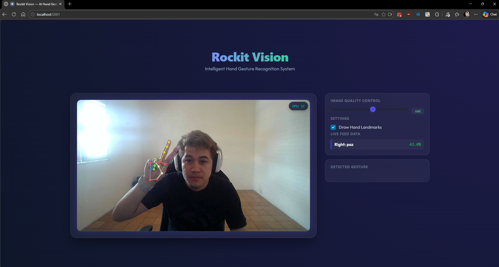

<div>

</div>

# NLW Operator 2026

## Fundamentos de Visão Computacional com LeNet-5

Este projeto foi desenvolvido durante o **NLW Operator (Trilha Python)** da Rocketseat. O objetivo principal é explorar os fundamentos da visão computacional e do aprendizado profundo através da implementação e treinamento da arquitetura clássica **LeNet-5** utilizando a biblioteca **PyTorch**.

## 🚀 Sobre o Projeto

Este repositório contém o desenvolvimento completo da trilha Python do **NLW Operator (2026)** da Rocketseat. O projeto evolui desde os fundamentos de Visão Computacional com modelos clássicos até a criação de uma aplicação web moderna e interativa.

O projeto está dividido em três pilares principais:

1.  **Fundamentos de Deep Learning**: Implementação e treinamento da rede neural **LeNet-5** para reconhecimento de dígitos manuscritos (MNIST) usando PyTorch.
2.  **Sistema de Reconhecimento de Gestos**: Uma pipeline completa de Machine Learning que inclui a extração de landmarks (pontos da mão) com **MediaPipe**, coleta de dados e treinamento de um classificador **RandomForest** customizado.
3.  **Rockit Vision (Aplicação Web)**: Um dashboard interativo construído com **FastHTML** que processa vídeo em tempo real via **WebSockets**, integrando os modelos de visão computacional em uma interface web de alta performance.

## 🛠 Tecnologias Utilizadas

- **Python 3.13+**: Linguagem principal do ecossistema.
- **PyTorch & Torchvision**: Construção, treinamento e avaliação de Redes Neurais Convolucionais.
- **MediaPipe**: Framework para extração de landmarks de mãos em tempo real.
- **FastHTML**: Framework moderno para criação de aplicações web rápidas em Python.
- **Scikit-Learn**: Treinamento do classificador de gestos customizados (Random Forest).
- **OpenCV**: Manipulação de imagens e fluxos de vídeo.
- **WebSockets**: Comunicação de baixa latência para o feed da webcam.
- **UV**: Gerenciador de pacotes e ambientes Python ultrarrápido.
- **Jupyter Notebook**: Documentação técnica e experimentação de modelos.

## 🏗 Arquitetura LeNet-5

O modelo segue a estrutura clássica proposta em 1998, composta por:
1. **Camada Convolucional 1**: 6 filtros 5x5 + Ativação Tanh/ReLU.
2. **Subsampling (Average Pooling)**: Redução de dimensionalidade 2x2.
3. **Camada Convolucional 2**: 16 filtros 5x5 + Ativação Tanh/ReLU.
4. **Subsampling (Average Pooling)**: Redução de dimensionalidade 2x2.
5. **Camada Totalmente Conectada (FC1)**: 120 neurônios.
6. **Camada Totalmente Conectada (FC2)**: 84 neurônios.
7. **Camada de Saída**: 10 neurônios (um para cada dígito).

## 📁 Estrutura do Repositório

```text
├── computer_vision_app/ # Aplicação Web (FastHTML) - Rockit Vision
│   ├── app.py           # Entrada principal do servidor web
│   ├── core/            # Lógica de processamento e utilitários
│   └── models/          # Modelos de ML carregados pelo app
├── recognize_system/   # Scripts de utilidade para o sistema
│   ├── collect_landmarks.py # Coleta de dados
│   ├── train_model.py       # Treinamento do modelo
│   └── webcam_recog.py      # Reconhecimento simples via terminal
├── data/               # Dataset MNIST
├── weights/            # Pesos LeNet-5
├── lenet5.ipynb        # Notebook LeNet-5
├── pyproject.toml      # Configuração de dependências
├── uv.lock             # Lockfile do uv
└── README.md           # Documentação
```

## 🔧 Como Executar

1. **Clone o repositório:**
   ```bash
   git clone https://github.com/seu-usuario/nlw-operator-python-lenet5.git
   cd nlw-operator-python-lenet5
   ```

2. **Crie um ambiente virtual:**
   ```bash
   python -m venv venv
   source venv/bin/activate  # No Windows: venv\Scripts\activate
   ```

3. **Instale as dependências:**
   ```bash
   pip install ipykernel torch torchvision matplotlib numpy
   # Ou se estiver usando uv:
   uv sync
   ```

4. **Execute o notebook:**
   Abra o arquivo `lenet5.ipynb` no seu editor ou via `jupyter notebook`.

## 🖐️ Sistema de Reconhecimento de Gestos (recognize_system)

Além da LeNet-5, o projeto inclui um sistema de reconhecimento de gestos customizado utilizando MediaPipe e Scikit-Learn.

### 1. Coleta de Dados (`collect_landmarks.py`)
Utilizado para capturar os pontos (landmarks) da mão e salvar em um CSV para treinamento.

**Execução:**
```bash
python recognize_system/collect_landmarks.py --label NOME_DO_GESTO --output hand_landmarks_data.csv
```

**Parâmetros:**
- `--label` (Obrigatório): O nome do gesto que você está coletando (ex: `joinha`, `pare`, `paz`).
- `--output` (Opcional): O nome do arquivo CSV onde os dados serão salvos. Padrão: `hand_landmarks_data.csv`.

**Controles durante a execução:**
- `s`: Salva um único frame de landmarks.
- `r`: Inicia/Para a gravação contínua de frames.
- `q`: Fecha o programa.

### 2. Treinamento do Modelo (`train_model.py`)
Treina um classificador `RandomForest` com base nos dados coletados.

**Execução:**
```bash
python recognize_system/train_model.py
```
*Este script utiliza por padrão o arquivo `hand_landmarks_data.csv` e gera os arquivos `gesture_model.joblib` e `label_encoder.joblib`.*

### 3. Reconhecimento em Tempo Real (`webcam_recog.py`)
Carrega o modelo treinado e realiza a predição dos gestos via webcam.

**Execução:**
```bash
python recognize_system/webcam_recog.py
```
*Certifique-se de que os arquivos `.joblib` e o `gesture_recognizer.task` estejam na pasta raiz do script.*

## 🚀 Rockit Vision — Web App (`computer_vision_app`)

Uma interface web moderna construída com **FastHTML** para processamento de gestos em tempo real via WebSockets.

### ✨ Funcionalidades
- **Live Feed**: Transmissão de vídeo em tempo real via WebSocket.
- **Controle de Qualidade**: Slider para ajustar a compressão da imagem enviada.
- **Visual Feedback**: Opção para desenhar landmarks diretamente no canvas.
- **Predição Dupla**: Exibe ícones especiais quando o mesmo gesto é detectado em ambas as mãos.

### 🛠️ Como Executar
1. Navegue até a pasta do app:
   ```bash
   cd computer_vision_app
   ```
2. Inicie o servidor:
   ```bash
   python app.py
     # Ou se estiver usando uv:
   uv run app.py
   ```
3. Acesse `http://localhost:5001` (ou a porta indicada no terminal) no seu navegador.

## 🎓 Créditos

Projeto realizado durante o evento **NLW Operator** da @Rocketseat, sob a instrução de @Arthur Kamienski.

---
Desenvolvido por [Davi Gomes Florencio](https://github.com/davigomesflorencio) 🚀
